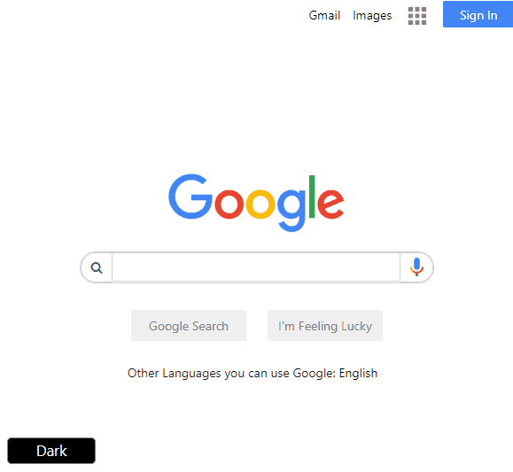
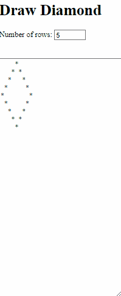
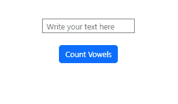
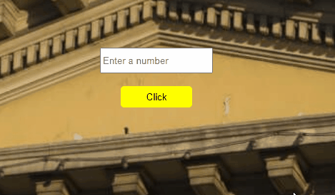

Javascripts Projects

<table class="table">
  <caption>JAVASCRİPT PROJECTS<caption>
  <thead>
    <tr>
      <th>S.Nu</td>
      <th align="left" width="15%">Project Name</th>
      <th align="left" width="15%">Repo Link</th>
      <th align="left">App Link</th>
      <th align="right">Overview</th>
    </tr>
  </thead>
  <tbody>
    <tr>
      <td align=center >1.</td>
      <td>Google Page</td>
      <td><a href="https://github.com/Tolga-Han-Yilmaz/google-landing-project" target="_blank">Repo Details</td>
      <td><a href="https://tolga-han-yilmaz.github.io/google-landing-project/" target="_blank">App Details</td>
      <td></td>
    </tr>
    <tr>
      <td align=center >2.</td>
      <td>Diamond</td>
      <td><a href="https://github.com/Tolga-Han-Yilmaz/Diamond_Javascript" target="_blank">Repo Details</td>
      <td><a href="https://tolga-han-yilmaz.github.io/Diamond_Javascript/" target="_blank">App Details</td>
      <td></td>
    </tr>
    <tr>
      <td align=center >3.</td>
      <td>Vowels Calculation</td>
      <td><a href="https://github.com/Tolga-Han-Yilmaz/Vowels" target="_blank">Repo Details</td>
      <td><a href="https://tolga-han-yilmaz.github.io/Vowels/" target="_blank">App Details</td>
      <td></td>
    </tr><tr>
      <td align=center >4.</td>
      <td>Roman Numbers</td>
      <td><a href="https://github.com/Tolga-Han-Yilmaz/Roman_Numbers" target="_blank">Repo Details</td>
      <td><a href="https://tolga-han-yilmaz.github.io/Roman_Numbers/" target="_blank">App Details</td>
      <td></td>
    </tr>
  </tbody>
</table>